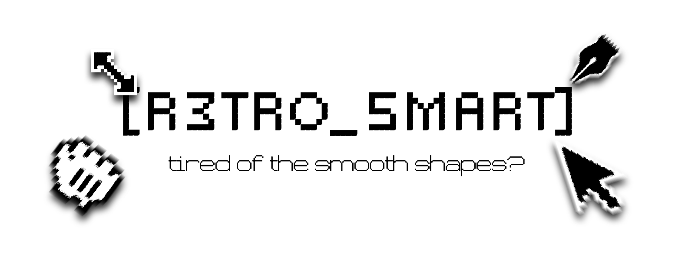
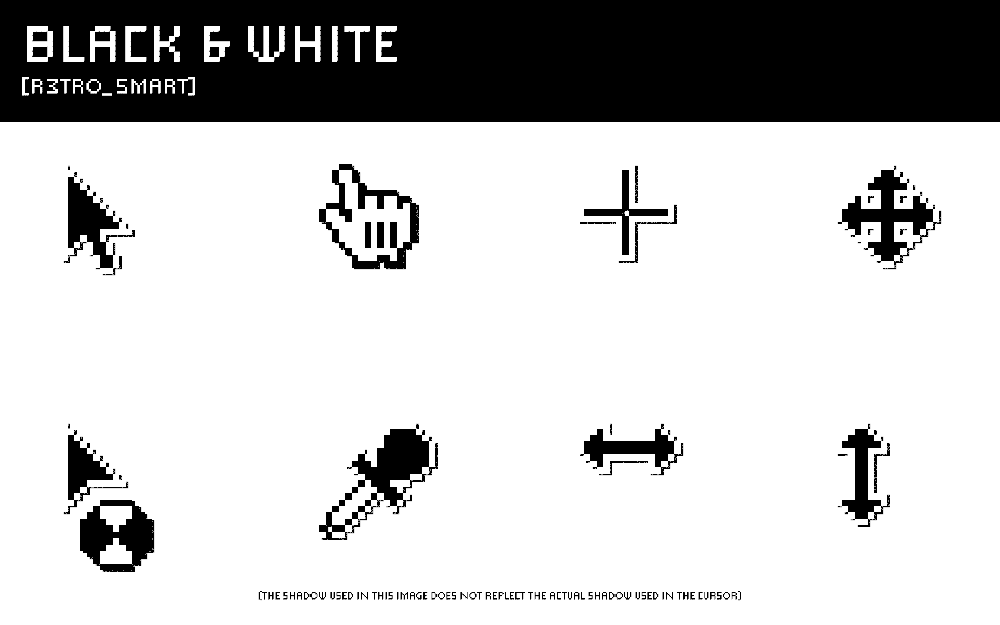
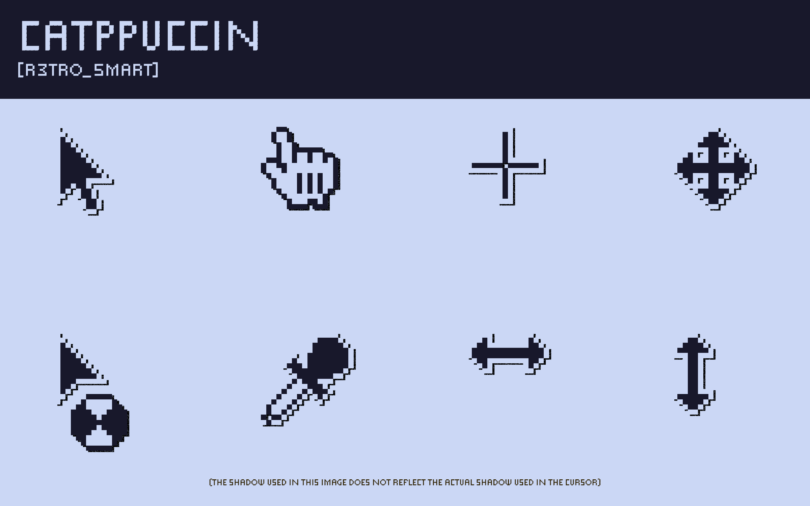
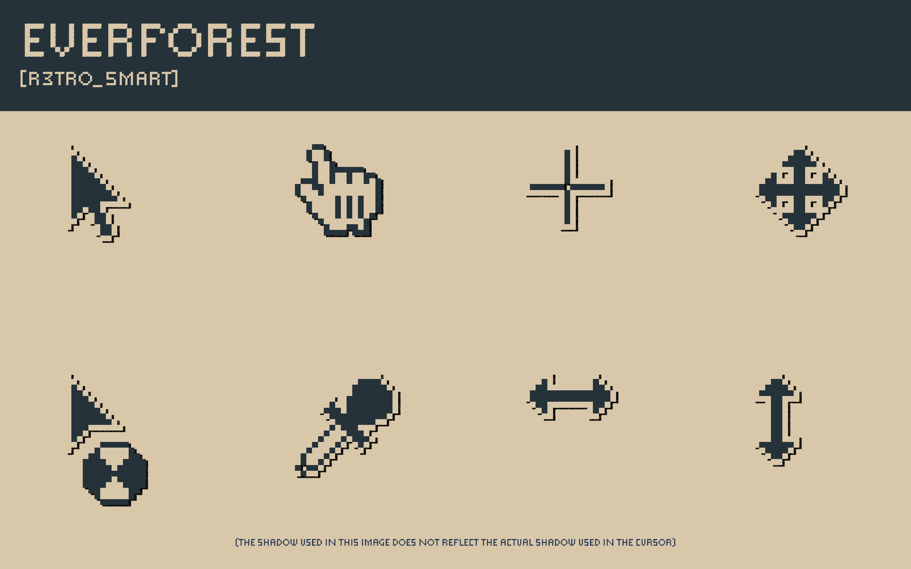
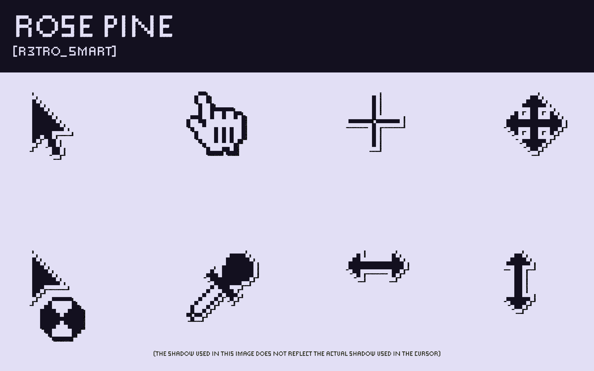
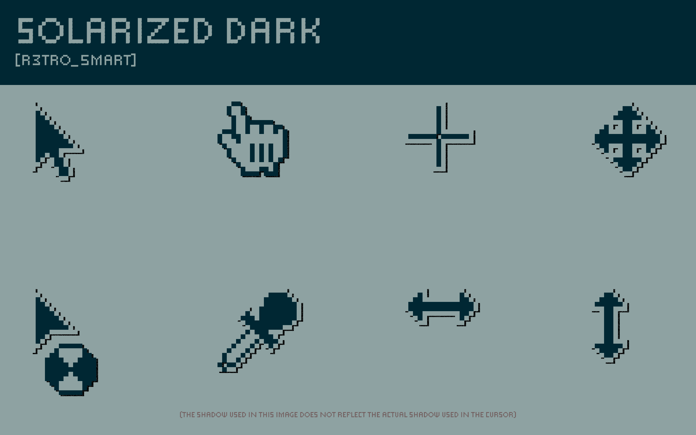
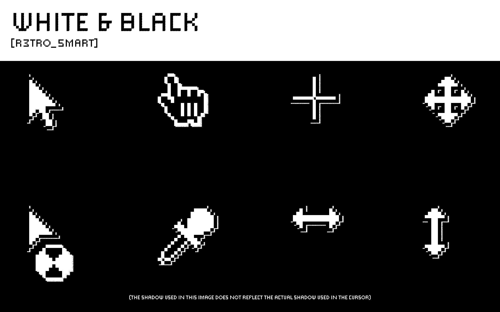

# Retrosmart Xcursor (fork)

An "8-bit-esque" X11 cursor theme, inspired by old Windows 3.x and classic
OS X cursors.

This is a fork of [retrosmart-x11-cursors](https://github.com/mdomlop/retrosmart-x11-cursors)
by [Manuel Domínguez López](https://github.com/mdomlop). Credit for the
original artwork and design goes to him — see [AUTHORS](AUTHORS) and
[NOTES.md](NOTES.md) for what changed in this fork.

## What's new in this fork

- New sizes: 32px, 64px, and 128px (up from the original set), better for
  HiDPI screens.
- A color scheme system, so new palettes are easy to add (see
  `color_schemes/`).
- Four theme variants: white/black, each with or without a drop shadow.
  - `retrosmart-xcursor-white`
  - `retrosmart-xcursor-white-shadow`
  - `retrosmart-xcursor-black`
  - `retrosmart-xcursor-black-shadow`
- Small touch-ups to a few cursor glyphs while adapting them to the new
  build pipeline — not a correction of the original design, just fit for
  the new sizes/hotspots.

Some of this fork's tooling and docs were put together with AI assistance.
The cursor artwork itself is hand-drawn/hand-edited pixel art

# Previews








## Requirements

- `bash`
- [ImageMagick](https://imagemagick.org/) (`convert`)
- `xcursorgen` (part of `xorg-xcursor` / `libxcursor` on most distros)
- `python3`

## Building

```sh
git clone https://github.com/useless-anvil/retrosmart-cursor.git
cd retrosmart_source
make            # or: ./build.sh all
```

This runs the full pipeline:

1. Colorizes the 32px hand-drawn sources in `src/base/` into each theme's
   palette.
2. Upscales to 64px and 128px (nearest-neighbor, keeps the pixel-art look).
3. Rasterizes to PNG (adds a drop shadow for `-shadow` themes).
4. Generates `xcursorgen` input files from `data/hotspots.yaml`.
5. Builds the final binary cursors, symlinked aliases (from
   `data/links.txt`), and `index.theme` files.

Output lands in `build_themes/<theme-name>/`. Copy a theme folder to
`~/.local/share/icons/` (or `/usr/share/icons/`) and select it in your
desktop environment's cursor settings.

Other build targets:

```sh
./build.sh xpm      # colorize + upscale only
./build.sh png      # rasterize only
./build.sh in       # generate xcursorgen input files only
./build.sh cursors  # build binaries/aliases/theme metadata only
./build.sh clean    # remove artifacts/ and build_themes/
```

- To change how a cursor looks: edit its file(s) in `src/base/` (32px only,
  everything else scales up from there).
- To change a cursor's hotspot (click point): edit `data/hotspots.yaml`.
- To add/rename a symlinked alias (e.g. `grab` → `openhand`): edit
  `data/links.txt`.

## License

GPL-3.0, inherited from the original project. See [COPYING](COPYING) and
[LICENSE](LICENSE). If you redistribute a modified version, keep the
GPL-3.0 license, keep the original copyright notice, and note that you've
made changes.
