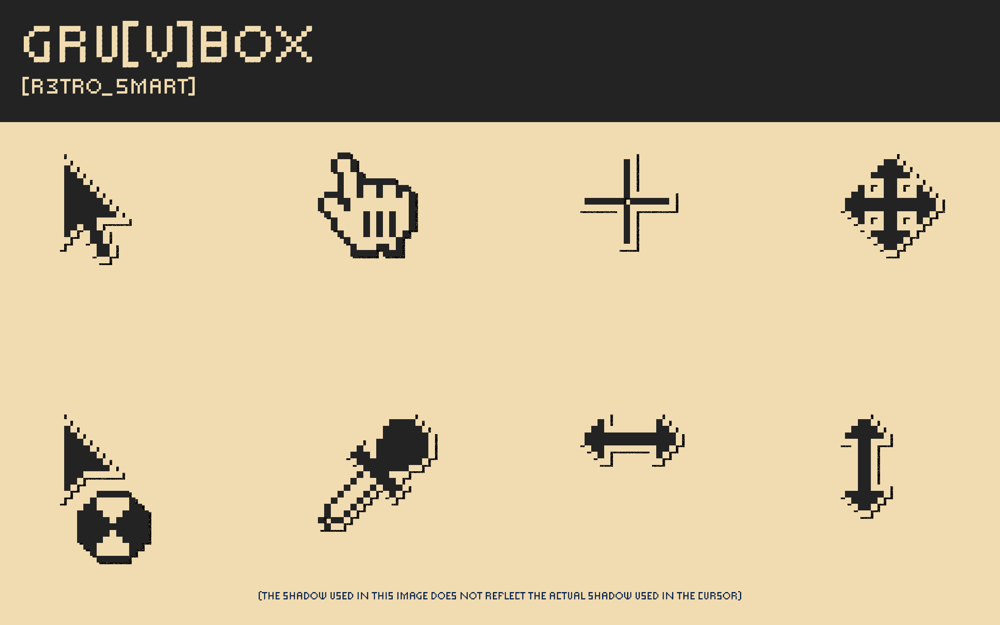

# Retrosmart Xcursor (fork)

An "8-bit-esque" X11 & Windows cursor theme collection, featuring classic OS X ("Mac-ish") and vintage Windows ("Win-ish") styles.

This is a fork of [retrosmart-x11-cursors](https://github.com/mdomlop/retrosmart-x11-cursors)
by [Manuel Domínguez López](https://github.com/mdomlop). Credit for the
original artwork and design goes to him — see [AUTHORS](AUTHORS) and
[NOTES.md](NOTES.md) for details on what changed in this fork.

## What's new in this fork

- **Multiple Cursor Styles**: Includes both `mac-ish` and `win-ish` cursor styles (`src/base/`).
- **HiDPI Support**: New sizes (32px, 64px, and 128px), rendered cleanly via nearest-neighbor scaling.
- **Unified Color Schemes**: Master configuration in `schemes.yaml` using clean `outline` and `fill` color fields.
- **Streamlined Multi-Core Build**: In-memory streaming directly to PNGs (no intermediate XPM files on disk) with parallel CPU execution (`nproc`).
- **Theme Variants**: 14 distinct color schemes, each with plain and drop-shadow versions.
- **Automated Previews & Pling Showcases**: Automated high-res preview sheet generator (`make previews`).

Some of this fork's tooling and docs were put together with AI assistance.
The cursor artwork itself is hand-drawn/hand-edited pixel art.

## Previews





## Requirements

- `bash`
- [ImageMagick](https://imagemagick.org/) (`convert`)
- `xcursorgen` (part of `xorg-xcursor` / `libxcursor` on most distros)
- `python3` (with `PyYAML` and `Pillow`)

## Building

```sh
git clone https://github.com/useless-anvil/retrosmart-cursor.git
cd retrosmart_source
make            # or: ./build.sh all
```

This runs the full pipeline:

1. **Recolors, upscales, and rasterizes**: Streams the 32px sources in `src/base/` through in-memory recoloring (`outline`/`fill`), nearest-neighbor upscaling (32px, 64px, 128px), and optional drop-shadow effects straight into PNGs (no intermediate `.xpm` files written to disk).
2. **Generates hotspot configs**: Creates `xcursorgen` input files from `data/hotspots.yaml`.
3. **Builds binary cursors**: Generates final X11 cursor binaries, symlinked aliases (from `data/links.txt`), and `index.theme` files.

Output lands in `build_themes/Linux/<theme-name>/` (and `build_themes/Windows/<theme-name>/`).

Other build targets:

```sh
./build.sh png      # recolor, upscale, and rasterize PNGs
./build.sh in       # generate xcursorgen input files only
./build.sh cursors  # build binaries/aliases/theme metadata only
./build.sh clean    # remove artifacts/ and build_themes/
make previews       # generate 2400x1500 previews & Pling showcase images
```

- To tweak theme palettes: edit `schemes.yaml`.
- To change how a cursor looks: edit its file(s) in `src/base/` (32px only).
- To change a cursor's hotspot (click point): edit `data/hotspots.yaml`.

## License

GPL-3.0, inherited from the original project. See [COPYING](COPYING) and
[LICENSE](LICENSE).
